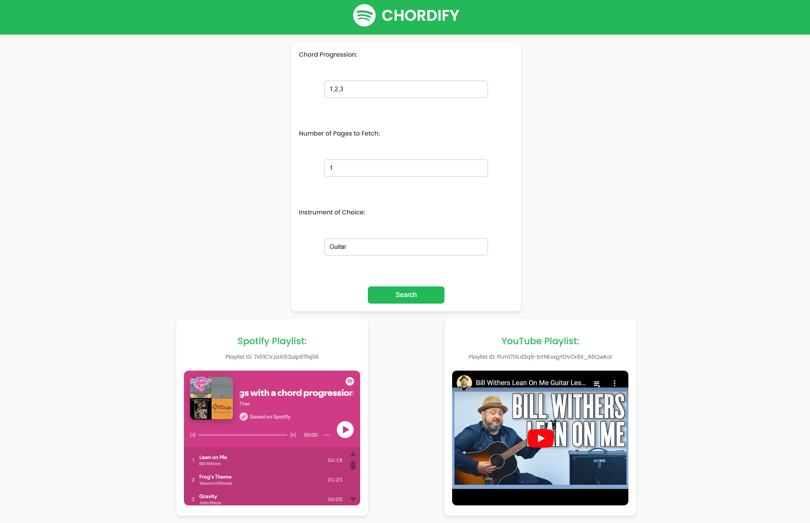

# Chordify Application

## Overview

**Chordify** is a web application that allows users to explore songs based on specific chord progressions. It integrates with **Hooktheory**, **Spotify**, and **YouTube** APIs to fetch songs, create playlists, and recommend tutorial videos for a selected instrument.

### Features:

1. **Chord Progression Search**: Enter a chord progression to discover songs that use it.
2. **Spotify Integration**: Automatically generate a Spotify playlist for the songs.
3. **YouTube Integration**: Generate a YouTube playlist of tutorials based on the chord progression and instrument.
4. **Customisable Search**: Specify the number of result pages to fetch and choose a preferred instrument.

**Example Output:** 




------

## Prerequisites

### Installations

Ensure you have installed all of the requirements in the requirement.txt file.

```
pip install -r requirements.txt
```

### API Keys and Configuration Files

- **Spotify API**:

  - Create a 

    ```
    spotify-keys.json
    ```

     file with the following structure:

    ```
    jsonCopy code{
      "username": "your-spotify-username",
      "client_id": "your-client-id",
      "client_secret": "your-client-secret",
      "redirect": "http://localhost/"
    }
    ```

- **HookTheory API**:

  - Create a 

    ```
    Details.json
    ```

     file:

    ```
    jsonCopy code{
      "username": "your-hooktheory-username",
      "password": "your-hooktheory-password"
    }
    ```

- **YouTube API**:

  - Download the `client_secret.json` file from your Google Developer Console and place it in the project root.

------

## Usage

### 1. Start the Application

Run the Flask application:

```
python app.py
```

The app will start on `http://127.0.0.1:5000/`.

### 2. Using the Web Interface

- Enter a **chord progression** (e.g., `1,4,5`).
- Specify the number of pages to fetch.
- Choose an **instrument** (e.g., `Guitar`, `Piano`) to tailor YouTube tutorial recommendations.
- Click **Search** to generate Spotify and YouTube playlists.

### 3. Output

- **Spotify Playlist**: Embedded in the interface and accessible via Spotify.
- **YouTube Playlist**: Embedded YouTube tutorial playlist for the specified instrument.


## Key Functions

### `app.py`

- **`index()`**: Main route that handles user inputs, fetches songs, and generates playlists.

### `tinuspotify.py`

- Spotify Integration:
  - `setup_spotify_credentials()`: Authenticate and set up Spotify API.
  - `create_spotify_playlist(sp, songs_df, playlist_name)`: Create and populate a Spotify playlist.
- HookTheory Integration:
  - `setup_hooktheory_credentials()`: Authenticate with HookTheory API.
  - `get_tracks(chord_progression, num_pages, auth_token)`: Fetch songs based on chord progression.
- YouTube Integration:
  - `setup_youtube_credentials()`: Authenticate and set up YouTube API.
  - `create_youtube_playlist(youtube, title, description)`: Create a YouTube playlist.
  - `add_videos_to_youtube_playlist(youtube, playlist_id, songs_df, instrument)`: Add tutorial videos to the playlist.
